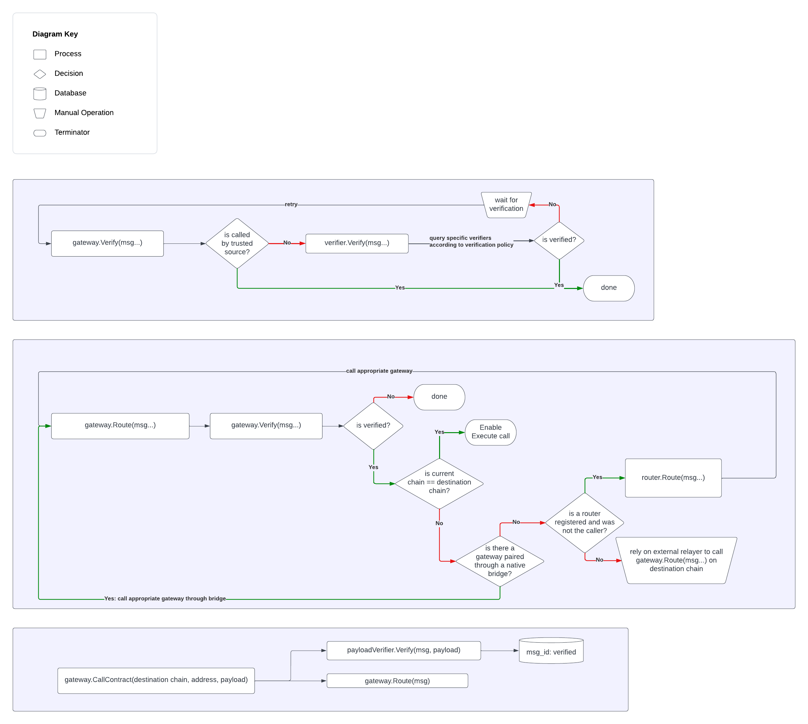

# RFC: unified gateways

# Description

This proposal aims to unify the interface for all gateways. Furthermore, it allows different routing mechanisms depending on the route (e.g. native routing for L2s/IBC, routing through axelar otherwise).

### Example: Avalanche → Moonbeam

A user calls `CallContract` with the appropriate payload on Avalanche. The gateway prepares the routing message and registers the payload with a payload verifier. It calls `VerifyMsgs`, which returns true because of the previously mentioned verifier. The destination is not Avalanche and there is no router registered on Avalanche, so `RouteMsgs` just emits a routing event and sets the state of the message to `routed`. Axelarons relayers listen for the routing event, pick up the message and broadcast it to `gateway.RouteMsgs(msg)` on axelarnet. Routing on axelarnet is blocked until the voting verifiers are done with their confirmation, after which `gateway.RouteMsgs(msg)` calls `router.RouteMsgs(msg)` on the registered router contract. The router finds the Moonbeam gateway and calls `gateway.RouteMsgs(msg)` on it. It’s still not the correct chain, but the gateway was called by the router, so there is no need for verification and it marks the message as routed and relies on relayers. Finally, relayers call `gateway.RouteMsgs(msg)` on Moonbeam. Here the contract has to wait until the verifier validates the multisig proof from axelarnet and because the destination chain matches Moonbeam, marks the message as routed and is done.

### Example: Ethereum → Arbitrum

A user calls `CallContract` with the appropriate payload on Ethereum. The gateway prepares the routing message and registers the payload with a payload verifier. It calls `VerifyMsgs`, which returns true because of the previously mentioned verifier. The destination is not Ethereum, but there is a router registered, so it calls `router.RouteMsgs(msg)`. The router finds the Arbitrum gateway and calls `gateway.RouteMsgs(msg)` on it. It’s called by the router, so it’s automatically verified. This gateway can make use of the native L2 bridge to arbitrum, so it directly calls its Arbitrum gateway counterpart. Similarly, the gateway on Arbitrum can skip verification because it’s called by a trusted source. The message has reached the destination chain, so the gateway marks it as routed and is done.

## Limits

This proposal does not include any authentication of contracts/users, as that doesn’t change the routing interface and can be handled separately.

Note also that the creation of a proof (multisig, zkp, …) is not included. That can potentially be triggered when a gateway reaches the point where it needs to rely on an external relayer, but it’s not necessary. It could happen out of band just as well, so it is not included in this routing schematic.

## Gateway interface overview

```
Message{
	string: ID
	[]byte: payload hash
  string: source chain
	string: source address
  string: destination chain
  string: destination address
}

Gateway interface{
	ReceiveMsgs([]Message: msgs)
	VerifyMsgs([]Message: msgs)
	RouteMsgs([]Message: msgs)
  CallContract(string: destination chain, string: destination address, []byte payload)
}
```

## Diagram



## Modifications

### Early routing

Potentially, we could remove the need for verification check and optimistically route. Execution on the destination chain would then wait until the verification has caught up with the routing (or not in the case of gmp express). To make this work, `gateway.VerifyMsgs` would need to be able to overrule `gateway.ReceiveMsgs` in case erroneous data was provided for the optimistic routing.

### Separate calls

`gateway.RouteMsgs` and `gateway.VerifyMsgs` call the previous steps in the process. For stricter separation we could remove that so `gateway.ReceiveMsgs`, `gateway.VerifyMsgs`, `gateway.RouteMsgs` always have to be called in that order.

### Minimal function arguments

In many cases it is probably enough to call functions just with `Message` ID. For the sake of simplicity I chose to use `Message` everywhere in this proposal.

### Remove ReceiveMsgs

If we don’t plan to implement early routing, there is no real benefit in tracking received messages, so we could remove that call completely.